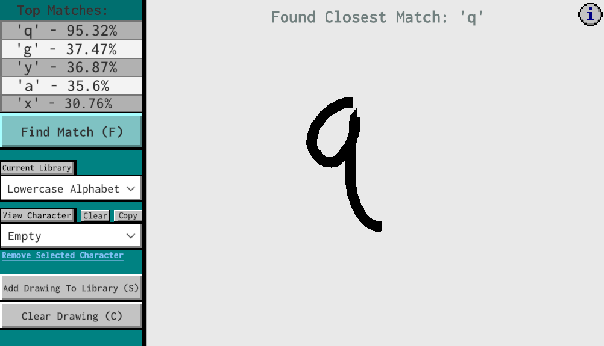
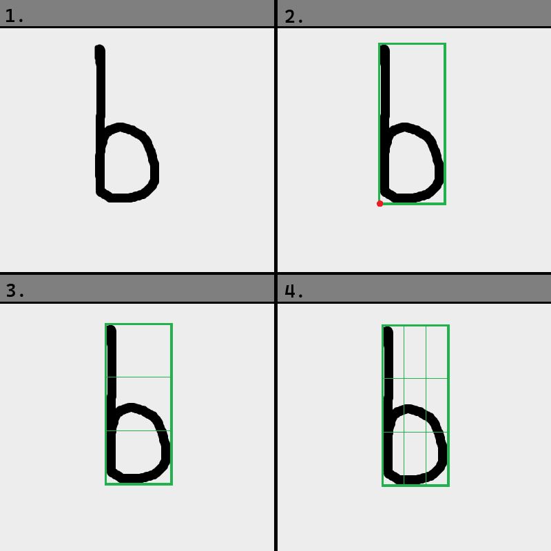
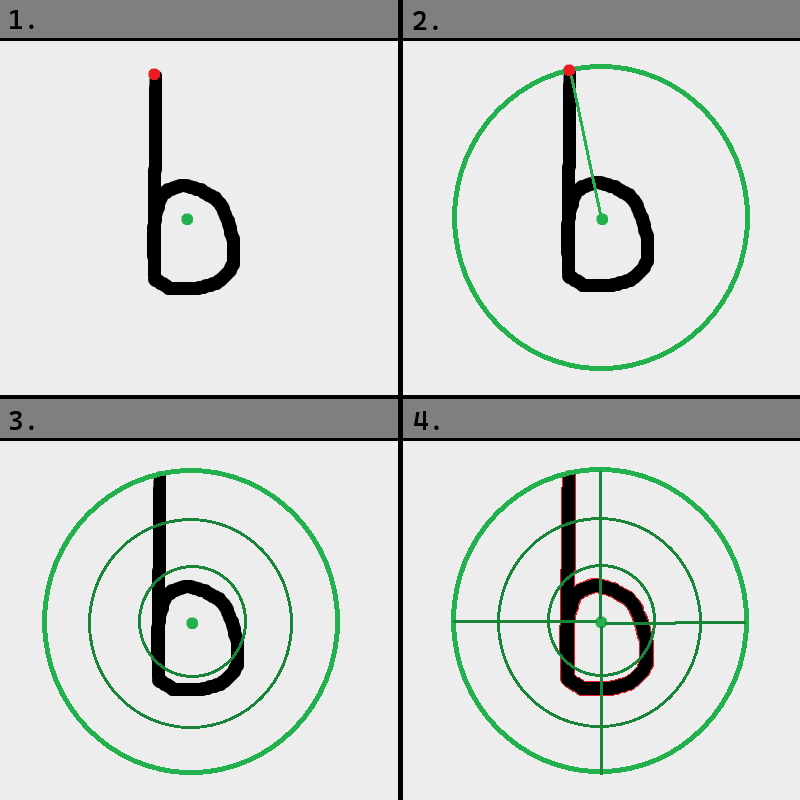
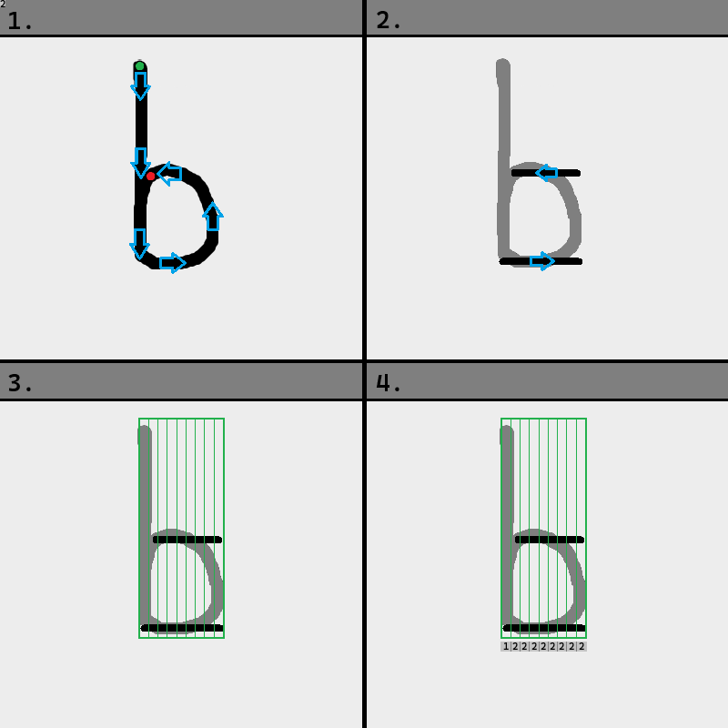
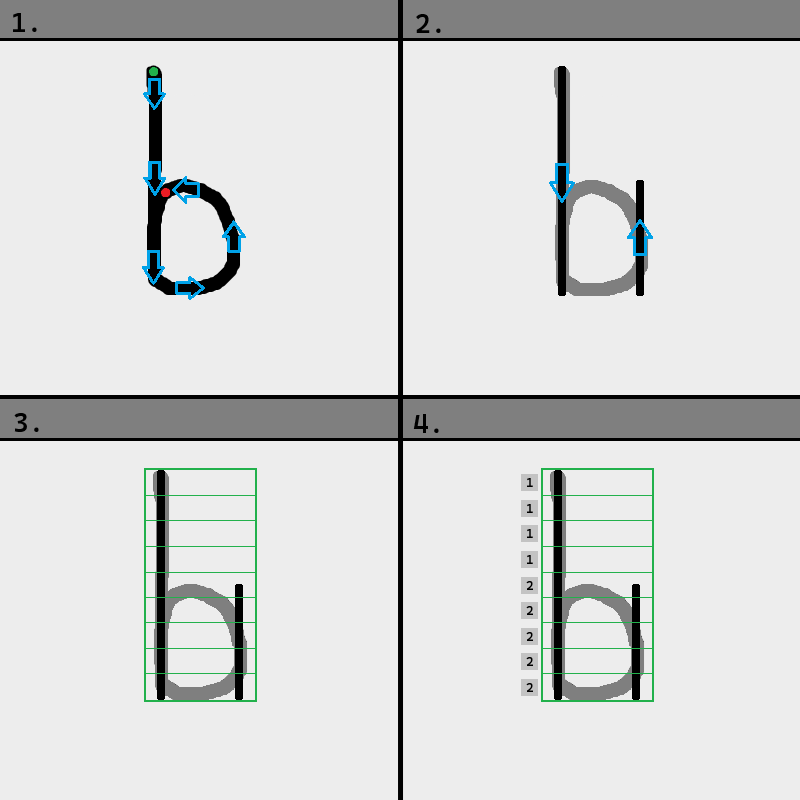

# Unity Drawing Recognition
An algorithm and tool developed to enable character and drawing recognition in Unity projects. It can be adapted to support features such as gesture-based mouse controls, handwriting-to-text, and general discernment of a user's mouse patterns. The algorithm itself can also be used as a general approach to character and drawing recognition outside of Unity.

Try out the demo [here](https://gilbertdyer.itch.io/drawing-recognition-demo)



The recognition system operates by comparing a drawing against stored libraries of characters. To define and store a character, only a single drawn example is required. This makes it fairly easy to create your own libraries of custom characters after setup and incorporate in-game mechanics that allow users to modify or add to these libraries during runtime.

When used with libraries of well-differentiated characters, this tool generally has extremely high accuracy. Based on current testing it is also very cheap to run.


##
[Setup](#setup)
- [Basic Setup](#basic-setup)
- [Creating Custom Libraries and Characters](#creating-custom-libraries-and-characters)


[How it Works](#how-it-works)
- [Overview](#overview)
- [GridMap](#the-gridmap)
- [CircleMap](#the-circlemap)
- [HorizontalMap](#the-horizontalmap)
- [VerticalMap](#the-verticalmap)


[Documentation](#documentation)
- [General Methods](#general-methods)
- [Prefabbed Library Initializers](#prefabbed-character-library-initializers)
- [Debug and Print Methods](#debug-and-print-methods)
- [Overview of Other Included Classes](#brief-overview-of-other-classes-used-in-drawingrecognition)

[Notes on Possible Issues](#notes-on-possible-issues-you-may-experience)
## Setup
### Basic Setup
To set up basic recognition functionality with the provided character libraries, you'll need to do the following:

1. Download the .zip file and unpack it.
2. Paste the DrawingRecognition folder from the 'Assets' folder to your project's asset folder.
3. Drag the DrawingRecognition prefab into your scene and select it to view its fields. 
4. Drag your main camera to the 'Camera' field of the MouseTracker script.
5. Set the draw area by dragging a 2D collider to the 'Draw Surface' field of the Drawing Recognition script. Alternatively, if this is set to none, drawing will be possible anywhere on-screen.
6. If your project uses a 2D backdrop, set the field 'Duck Point Z Value' to a Z value that lies behind the backdrop from the perspective of the camera. This is optional, but gets rid of the connecting lines between separately drawn segments.
7. In a separate script, implement runtime controls to clear drawings and get matches to them (examples below)

	#### Ex.1 With Hotkeys:
	```c#
	[SerializeField] private DrawingRecognition drawingRecognition // reference to the DrawingRecognition script
	public Character match; // For storing the match
	private void CheckDrawRecControls() {
		if(Input.GetKeyDown(KeyCode.C)) {
			drawingRecognition.ClearDrawing();
		}
		if(Input.GetKeyDown(KeyCode.F)) {
			match = drawingRecognition.GetMatch(); // Stores match & prints its name to debug log 
		}
	}
	```
	#### Ex.2 Clear and GetMatch on left mouse up (simpler control scheme, but supports only single-stroke drawings):
	```c#
	[SerializeField] private DrawingRecognition drawingRecognition // reference to the DrawingRecognition script
	public Character match; // For storing the match
	private void CheckDrawRecControls() {
		if(Input.GetKeyUp(KeyCode.Mouse0)) {
			match = drawingRecognition.GetMatch(); // Stores match & prints name to debug console 
			drawingRecognition.ClearDrawing();
		}
	}
	```
	*(Alternatively, calling GetMatch() on mouse up and implementing ClearDrawing() separately would support multi-stroke drawings and consistently track the current match during runtime.)*

##
After this, you should be able to draw on-screen, clear the drawing, and view a drawing's closest match to the lowercase alphabet through the debug log's output. If you want to preview the characters included in the current library, either use the [itch demo](https://gilbertdyer.itch.io/drawing-recognition-demo) or implement calls to DisplayCharacter().

The rest of the setup is dependent on the project you implement this to. From here, you could add your own libraries of custom characters (explained further below), or even add support for player-sided custom character creation during runtime through AddDrawingToLib(). 

##
### Creating Custom Libraries and Characters
A large feature this project aims to support is the the ability to store prefabricated libraries of custom drawings/characters that are accessible during runtime. Prefabbed libraries are structured as initializer methods within the 'DrawingRecognition' script that load their stored characters onto an input character library. You can view the included initializers near the bottom of the script for reference.

Before creating a custom library, it is first recommended to set up a hotkey to 'PrintCurCharacter()'. This copies a code snippet to your clipboard that stores the current drawing and initializes it as a character when pasted into and ran in an initializer. 

Next, you'll need to create an empty initializer method in the DrawingRecognition script to paste this into. (shown below)
```c#
public void InitializerExample(CharacterLibrary charLib) {
	charLib.ClearLibrary(); // Remove if you don't want to clear the library
	// Paste output of PrintCurCharacter() or PrintCharacterLibrary() below
	
}
```
After pasting your prefabs, in the same script, you'll need to create a library setup method and call it in Awake(). This method will handle the initial setup of the character libraries and the adjustable parameters used in comparisons. 

Copy the example below and edit the middle block according to the name of your initializer method and the desired name of your library. 

```c#

// SetupExample() should be called in Awake()
public void SetupExample() {
	libraryList = new List<CharacterLibrary>(); // Initialize libraryList
	
	// Repeat this block for each character library
	CharacterLibrary name = new CharacterLibrary("name"); // Create a new character library
	InitializerExample(name); // Load the prefabbed library onto it
	libraryList.Add(name); // Add the library to the list 
	
	// Set the current library, weight, and precision values (Required)
	currentLib = libraryList[0]; // Set the initial library selected on start
	SetWeights(1.0, 1.0, 1.0, 1.0);
	SetPrecision(3);
}
```
*(InitializerExample() and SetupExample() are both included in the "Default Initializer" region of the DrawingRecognition script to modify, along with a call to SetupExample() in Awake() that has been commented out)*

Lastly, uncheck DrawingRecognition's serialized field 'Use Default Initializer' and call the library setup method in Awake(). After this, your prefabbed library should be initialized and selected on play.

Pasting characters and editing the setup method will be the extent of editing you'll need to do to the DrawingRecognition script. All other functionality can be implemented through calls to the script.

### A Quick Note on Using Drawings as Player Controls or Triggers

If you want drawings to each trigger specific player controls or actions, identifying characters returned by GetMatch() will be important. To identify a character, either access its name with *'</span>[character].name</span>'* or use the reference to the returned character itself, assuming references to it are well maintained in your libraries.

Running this name or reference through a switch case statement will then allow you to map drawn characters to actions.
##
## How it Works

### Overview
During runtime, drawings are stored as an instance of the “Bitmap” class, which converts the points of a drawing into four different map-like representations: the **GridMap, CircleMap, HorizontalMap**, and **VerticalMap**. These representations each have their own process for creation and comparison score calculations. 

To calculate an overall comparison score for recognition, 2 characters' maps are compared against each other to obtain the comparison scores of each map. Then, each map's score is multiplied by its respective weight value, which is assigned on start by SetWeights() and used to tune how much impact each map has on the overall score. After this, we take the overall score as the sum of the modified scores.

Using multiple maps reduces any bias towards certain types of characters by combining the strengths and weaknesses of each map:

- The GridMap works well for distorted characters that are squished or stretched, but is less effective for characters prone to being off-center like 'T', or of variable stem length, like 'p' or 'b'.

- The CircleMap works well across the board. It is less affected by GridMap's pitfalls, but doesn't handle distortion as well.

- The HorizontalMap and VerticalMap work well for distinguishing egregious differences between characters, but may fall short for more complicated drawings.


Another thing to note is that **this process ignores the drawn order of points**. This is based on the idea that the order a character is drawn in may vary from person to person. As such, for use cases where the directional trend of the drawing is important (e.g. directional swiping controls), you should probably use a different approach to recognition, such as the [1$ Recognizer](https://depts.washington.edu/acelab/proj/dollar/index.html), or adapt your drawings accordingly.

The next four sections offer visuals and more in-depth explanations for each map.
##
*Note: The variable 'n' referred to in each of the following overviews is the 'precision' value set in the DrawingRecognition script, set to 3 by default.*
##
### The GridMap:
A 2D grid representing the distribution of points of a drawing.

**Strategy:**
1. Obtain the points of the drawing
2. Find the bounding values of the drawing and take the left and bottom bounds as the new origin for each axis
3. Divide the vertical axis into n slices of equal area
4. Divide the horizontal axis into n slices of equal area



Now, we assign each cell of the created grid a value equal to the percentage of points it contains out of the entire drawing. The result is a 2D array that will look similar to the following for the letter 'b':

| 0.167    | 0.0   | 0.0   | 
|-----------------|------------------|-----------------|
| 0.225   | 0.069   | 0.069   | 
| 0.225   | 0.069   | 0.179   | 

To use these values for character recognition, we take the mean squared error between two characters' GridMaps as a comparison score. To calculate this, we compare the GridMaps at each cell, adding the squared difference between each of their cells to a total error score. Then, we divide the total error by the number of cells (equal to n * n) to obtain a normalized score between the two maps, where a lower score means a more likely match.
##
### The CircleMap
A 2D radial grid representing the distribution of points of a drawing.

**Strategy:**
1. Calculate the geometric median of all points in the drawing, and the furthest point from it
2. Draw a circle centered around the median point, with a radius extending to the furthest point
3. Divide the circle into n rings of equal thickness
4. Divide each ring into quadrants



Like the GridMap, we assign each quadrant a value equal to the percentage of points it contains out of the entire drawing. The CircleMap is structured as a 2D array where each primary index represents a ring and each secondary index represents the quadrant values within the ring. The CircleMap of the letter 'b', will look similar to the following:

Ring 1 (Innermost):
|0.153  |0.102  |
|--|--|
|0.093  |0.025  |
Ring 2:
|0.119  |0.000  |
|--|--|
|0.280  |0.110  |
Ring 3:
|0.119  |0.000  |
|--|--|
|0.000  |0.000  |


For score calculation, we use the same mean squared error method as the GridMap, comparing quadrants instead of cells.
##
*Note: the next two maps take into account the order points are drawn in, though this is only for line simplification; the drawn order still has a negligible effect on comparison scores*
### The HorizontalMap
A 1D representation that measures the line density of a drawing across its horizontal axis.

**Strategy:**
1. Obtain the points of the drawing and their drawn order
2. Start a line segment from the first point, ending it and and beginning a new one whenever the trend of the points in the x direction changes
3. Divide the drawing into (n * n) vertical slices of equal area
4. Obtain an array of values representing the number of lines that intersect with each vertical slice



*Array representation of this HorizontalMap: {1, 2, 2, 2, 2, 2, 2, 2, 2}*

This approach is especially effective for common characters and shapes, as most of these can be easily simplified into down lines and curves.

To calculate a HorizontalMap comparison score, we compare two HorizontalMap arrays at every index. If the values of the arrays at an index are not equal, we increment the total error score by '(1 / total # of slices)', effectively the percentage of the drawing that index represents. 

To ensure off-center drawings are caught, we do additional comparisons after offsetting one of the arrays' indices to the right or left, repeating this n times to the left and n times to the right. After this, we take the lowest error score out of all the comparisons as our final score.
##
### The VerticalMap
A 1D representation that measures the line density of a drawing across its vertical axis.

**Strategy:**
1. Obtain the points of the drawing and their drawn order
2. Starting from the first point, start a line segment, ending it and and beginning a new one whenever the trend of the points in the y direction changes
3. Divide the drawing into (n * n) horizontal slices of equal area
4. Obtain an array of values representing the number of lines that intersect with each slice



*Array representation of this VerticalMap: {1, 1, 1, 1, 2, 2, 2, 2, 2}*

The comparison score calculation follows the exact same process as the HorizontalMap. 

## Documentation


### General Methods:
*(You should call these from a reference to the DrawingRecognition script)*


*Note: The return type 'Character' is not be confused with the primitive 'char' type.*
| Type | Method | Description |
|-----------------|------------------|-----------------|
| void    | SetLibrary(int libraryNum)    | Sets the current character library to compare from  & modify. By default, set to lowercase alphabets (0) on start.    |
| void     | SetDrawSurface(Collider2D collision2D)    | Sets the area on screen the mouse must be within to draw new points.    |
| void     | ClearDrawing()    | Clears the drawing and its stored points.    |
| void     | ShowDrawing(bool inp)    | Shows (true) or Hides (false) the drawn line (visual change only).     |
|void  	|EnableDrawing(bool  inp)	|Enables (true) or Disables (false) the drawing controls within MouseTracker. *Useful to integrate into your player controls states to prevent drawing during certain events.* 	|
| void     | SetWeights(double circleMapWeight, double gridMapWeight, double horizontalMapWeight, double verticalMapWeight)    | Sets the weights applied to each bitmap during comparison score calculation. *Recommended to keep as (1.0, 1.0, 1.0, 1.0) unless certain maps do not work as well for a use case.*   |
| void     | SetPrecision(int input)    | Updates the precision/width of stored bitmaps in current library. *3 is recommended for most applications; a higher precision does not necessarily mean higher recognition accuracy.*    |
|Character 	|GetMatch()	|Returns the closest match to the drawing in the current character library	|
|Character 		|GetMatch(CharacterLibrary charLib)	|Returns the closest match to the drawing in a specified character library	|
|List<KeyValuePair<Character, double>> 	|GetMatchList()	|Returns a list of (Character -> Score) KVPs, representing the drawing's comparison score to each character in the current library.	List is sorted from closest matches (highest % score), to least likely matches (lowest % score).|
|List<KeyValuePair<Character, double>> 	|GetMatchList(CharacterLibrary charLib)	|Returns a sorted list of KVP scores based on a specified library's characters. Same structure as GetMatchList().	|
|void 	|AddDrawingToLib(string charName)	|Creates a character from the current drawing and adds it to the current library	|
|void 	|AddDrawingToLib(string charName, CharacterLibrary charLib)	|Creates a character from the current drawing and adds it to a specified library	|
| void     | AddCharToLib(Character character)    | Adds a character to the current library    |
| void      | AddCharToLib(Character  character, CharacterLibrary  charLib)    | Adds a character to a specified library    |
|void	|RemoveCharacter(Character character)	|Removes a character from the current library, if found.	|
|void		| RemoveCharFromLib(Character character, CharacterLibrary  charLib)	|Removes a character from a specified library, if found.	|
|void		| RemoveCharFromLib(string  charName) 	|Removes a character from the current library by string name lookup, if found.	|
|void		| RemoveCharFromLib(string  charName, CharacterLibrary  charLib)	|Removes a character from a specified library by string name lookup, if found.	|
|List\<CharacterLibrary\>	|GetLibraryList()	|Returns the list of stored libraries	|
|void	|ClearLibraryList()	|Clears the list of stored libraries	|
|List\<Character\>	|GetCharList()	|Returns the list of characters stored in the current library	|
|List\<Character\>	|GetCharList(CharacterLibrary charLib)	|Returns the list of characters stored in a specified library|
|void |DisplayCharacter(Character character) |Sets the drawing to a copy of the specified character | 

### Prefabbed Character Library Initializers:
| Type | Method | Description |
|-----------------|------------------|-----------------|
|void  	|InitializeLowercaseAlphas(CharacterLibrary  charLib)	|Initializes a prefabbed character library of lowercase alphabet letters to a character library.	|
|void  	|InitializeSymbols(CharacterLibrary  charLib)	|Initializes a prefabbed character library of symbols to a character library.	|
|void  	|SetupDefaultLibraries()	|Initializes the included libraries. Clears stored libraries, then initializes 5 libraries: The lowercase alphabet, A set of symbols, and 3 empty libraries. Sets precision to 3 and weights to (1.0, 1.0, 1.0, 1.0).|

### Debug and Print Methods:
| Type | Method | Description |
|-----------------|------------------|-----------------|
|string	 |PrintCurCharacter()	 |Returns a code snippet to initialize the current drawing as a prefabbed character. If called in the Unity editor during runtime, copies the string to the clipboard. Paste the returned string inside a character library initializer method in the DrawingRecognition script.	| 
|string  	|PrintCharacterLibrary()	|Returns a code snippet to initialize all characters in the current library as prefabbed characters. If called in the Unity editor during runtime, copies the string to the clipboard. Paste the returned string inside a character library initializer method in the DrawingRecognition script.	|
|void	|PrintGridMap(Bitmap  bitmap)	|Prints the 2D GridMap representation of the current drawing. Note that if working correctly, cell values should sum (very close) to 1.	|
|void  	|PrintCircleMap(Bitmap  bitmap)	|Prints the 2D circle map representation stored by a bitmap. Each ring of the map is printed in order from inner to outer ring as 2x2 group of values.	|
|void  	|PrintCoMCircleMap(Bitmap  bitmap)	|Prints the 2D circle map representation stored by a bitmap, using the center of mass as the centerpoint instead of the geometric median used by default. Use this for comparing the effectiveness of the two centerpoints.	|
|void  	|PrintFlatMapHorizontal(Bitmap  bitmap)	|Prints the horizontal FlatMap representation stored by a bitmap. 	|
|void  	|PrintFlatMapVertical(Bitmap  bitmap)	|Prints the vertical FlatMap representation stored by a bitmap.	|
##
### Brief Overview of Other Classes used in DrawingRecognition 
Included are three non-monobehavior scripts used throughout DrawingRecognition and MouseTracker. These are model classes you are not required to interact with, but could end up editing to fit your use case better. Documentation for each of these classes can be found at the header of their respective scripts.

**Bitmap:** Stores the points of a drawing and various map representations of it for usage during comparison. Handles calculations of raw comparison scores between Bitmaps.

**Character:** Stores a Bitmap and a name to be associated with it. Does not contain behavior. *(This class is a bit redundant, ignoring readability)*

**CharacterLibrary:** Stores a list of Characters and handles character recognition. Features methods that return the closest match to an input Character by calculating an input's comparison score to each Character in the stored list. Also holds map weight and precision values used for comparison, along with callable methods to update these values.

  
  
  ##
## Notes on Possible Issues you may Experience


**The accuracy for certain characters is low:**
- In general, to raise the accuracy for problem characters, redraw them with more exaggerated features and/or adjust the weights as described above. If you are using a precision value that is even, try switching to one of its closest odd values.

- One or more of the map representations may not work well for these characters. To diagnose, uncomment the debug print line at the bottom of the GetScore() method within the CharacterLibrary script. This prints the the individual comparison scores returned by each map for every character during comparison. Generally, if a character is a good match, most of its scores will be below ~0.2. Any scores consistently above ~0.7 for a certain map (highest possible score for each map is 1.0) when you expect to see a match may indicate that you should lower the weight for that map accordingly with SetWeights(). 

**Accuracy is lower when the mouse moves fast / There are gaps in the points being stored by the mouse**
- This occurs at lower framerates; if you experience low framerates in the editor while trying to create a custom character prefab, try drawing slowly and at a steady speed. 

- If low framerates are inevitable or required both in the editor and during play, you can try to remedy this by adding extra versions of characters drawn at lower framerates, matching the speed you expect players to draw at for each portion of a character.


